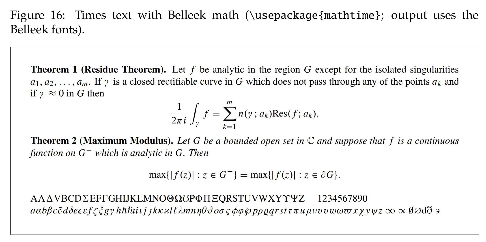

被这个问题困扰了大半年时间，今天终于弄明白，正好趁热打铁，总结一下。

实际上，我是一直不很喜欢LaTeX的原生数学字体的，特别是数字的写法让我非常难受，一直想换一种数学字体。后来找到了一篇论文，专门收集了LaTeX的所有免费字体，名叫**[A Survey of Free Math Fonts for TeX and LaTeX](http://www.nic.funet.fi/index/TeX/CTAN/info/Free_Math_Font_Survey/survey.pdf)**于是乎就找到了我至今为止最为满意的字体，有着times风格，同时积分号和求和号的写法我也大为喜欢，大体效果如下：

论文上的指导非常简单，照着它的意思，直接在加载宏包区域再加一行代码